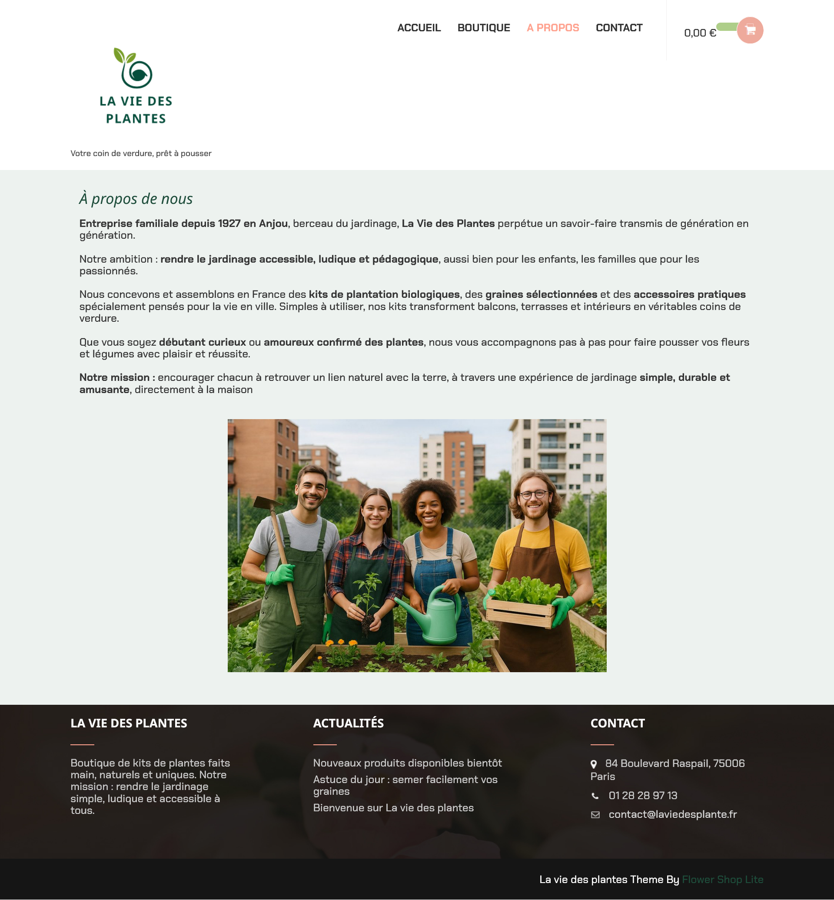
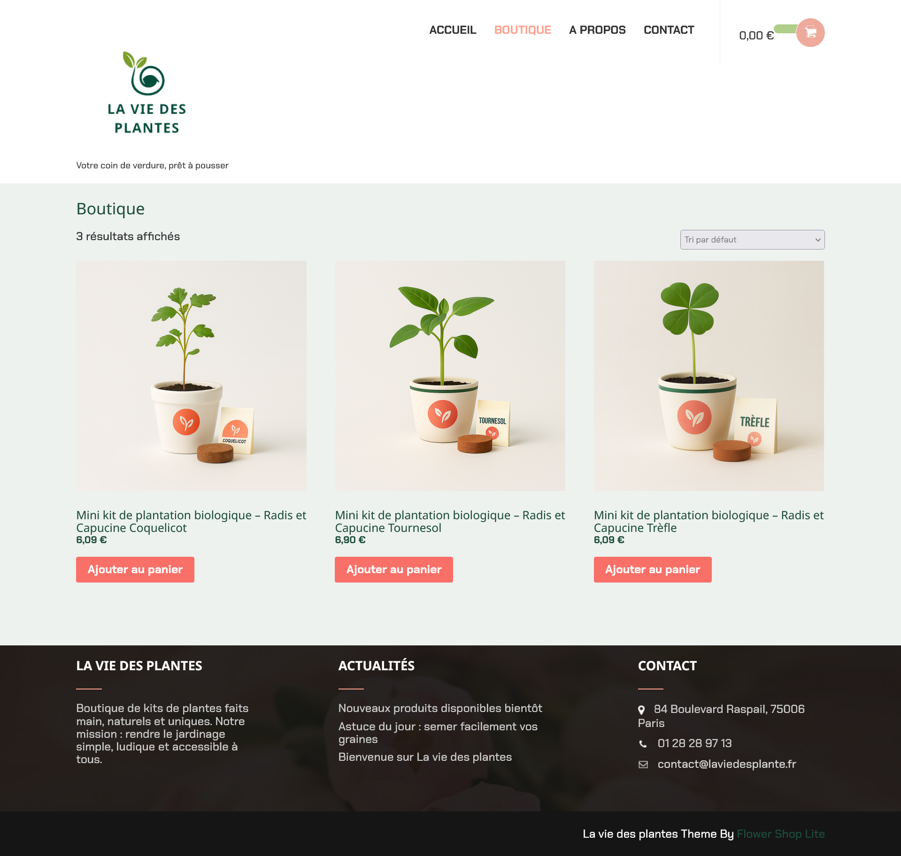
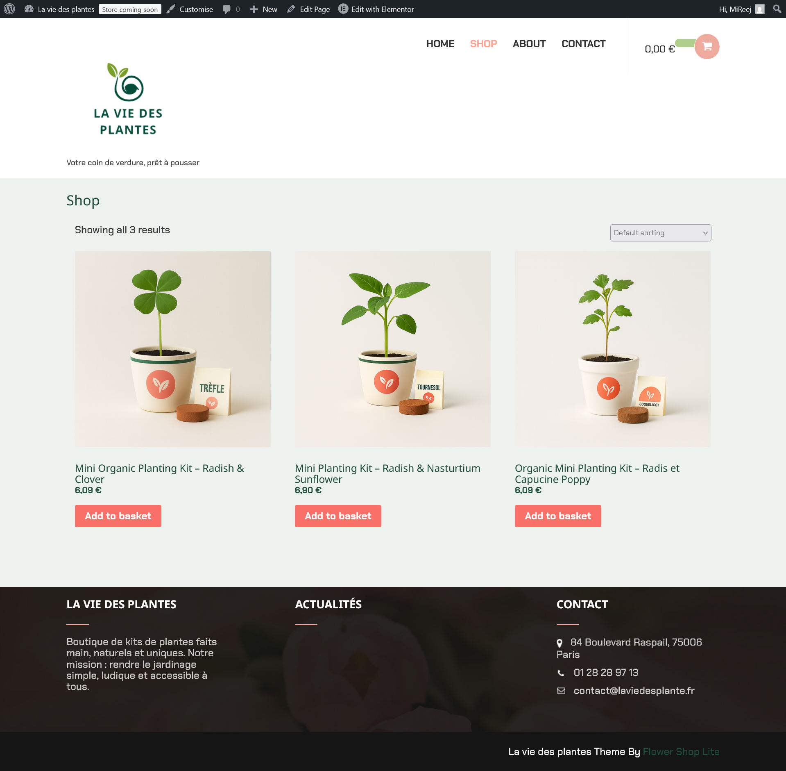
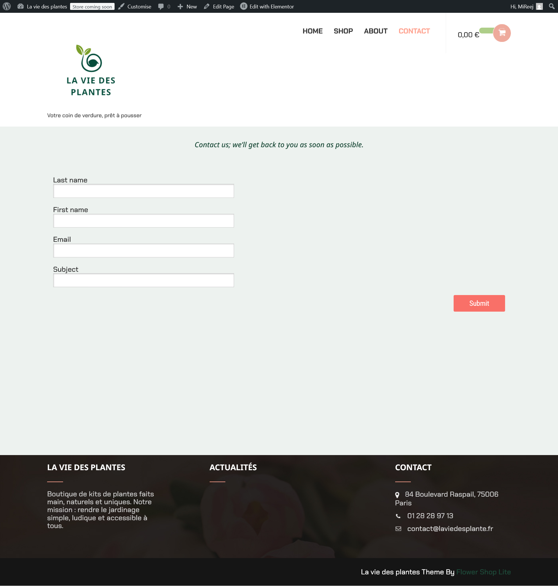
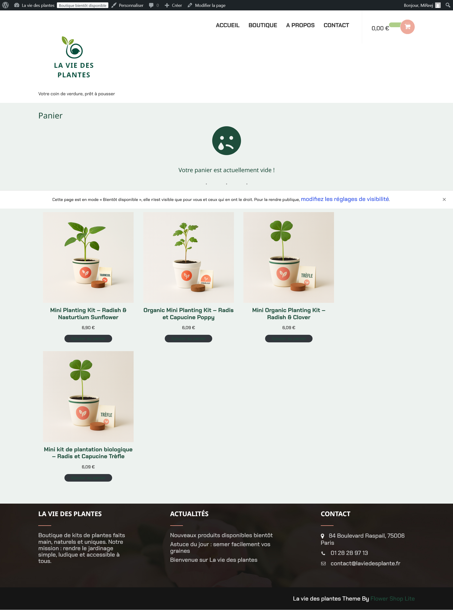
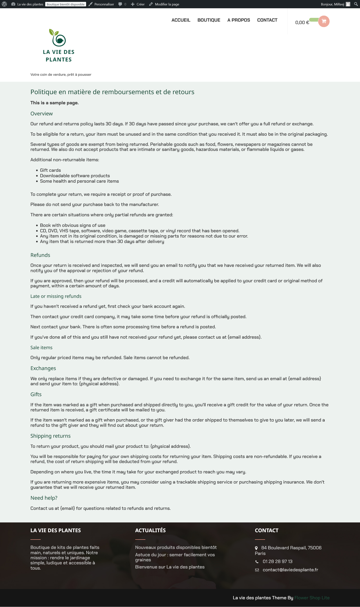
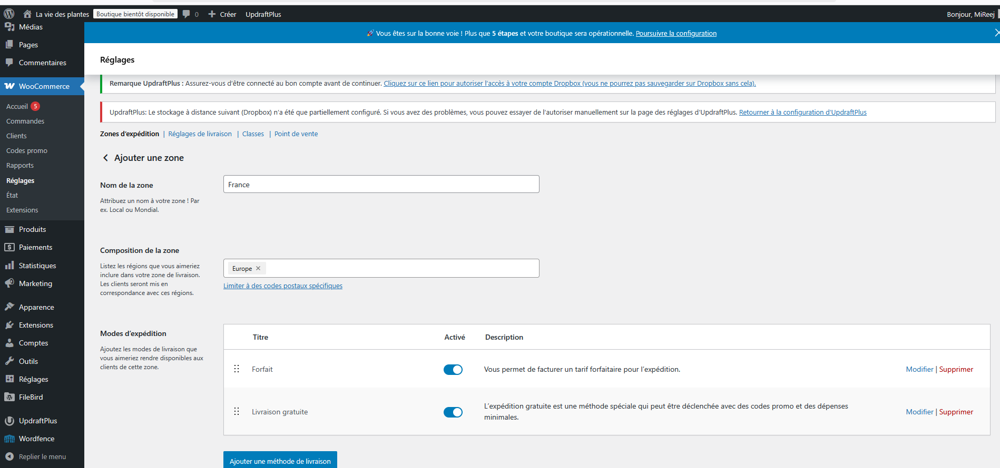

# Devoir WordPress – Projet Final

## 👩‍🎓 Étudiant·e
- Nom : RABARISON MIALY
- Devoir : La vie des plante- Site Wordpress

---

## 🔑 Accès administrateur
- URL locale :  `http://localhost/wordpress/wp-admin`
- Identifiant admin : admin2
- Mot de passe : Test@135791113

## 🌐 Accès au site
- URL : `http://localhost/wordpress/`

*(Ces identifiants sont fournis uniquement pour la correction locale.)*

---

## 📦 Contenu du dépôt
- **WordPress** : fichiers du CMS (nettoyés).
- **wp-content/themes/** : Flower Shop Lite, Twenty Fwenty-Five.
- **wp-content/plugins/** :  Akismet, Contact Form 7,Elementor,WooCommerce, Polylang,FileBird Lite,Fonts Plugin,Jetpack,Klaviyo,ShopLentor,Ultimate Addons pour Elementor Lite,UpdraftPlus, WooCommerce PayPal Payments,WooCommerce Tax,WooPayments,Wordfence Security.
- **db.sql** : export de la base de données.
- **screens/** : Pages: Accueil,Boutique, A propos, Contact, Home, Shop, About,Contact (english), panier politique de confidentialité,politique de remboursement.
- **.gitignore** : exclusions (uploads, caches, sauvegardes…).
- **README.md** : ce guide.

---

## ▶️ Installation en local (pour le correcteur)
1. Installer **WampServer** ou **XAMPP**.
2. Copier ce projet dans `www/` (Wamp) ou `htdocs/` (XAMPP).
3. Créer une base de données nommée **monsite**.
4. Importer `db.sql` via **phpMyAdmin**.
5. Vérifier/adapter `wp-config.php` :
   ```php
   define('DB_NAME', 'monsite');
   define('DB_USER', 'root');
   define('DB_PASSWORD', ''); // vide par défaut
   define('DB_HOST', 'localhost');

## 🌐 Multilingue
- Plugin de langue : Polylang
- Langues disponibles : Français / Anglais

## 🔒 Sécurité & maintenance
- Plugins de sécurité : [ex. Wordfence, Jetpack]
- Sauvegardes : export `db.sql` fourni (médias exclus)
- `.gitignore` mis en place pour exclure les fichiers volumineux et sensibles

---

## 🧩 Thème & plugins utilisés
- **Thème actif :** ** voir liste complète dans la section "📦 Contenu du dépôt"
- **Plugins clés :** voir liste complète dans la section "📦 Contenu du dépôt"

---

## 📸 Captures d’écran
Toutes les pages principales sont dans le dossier `screens/` :

## 📸 Captures d’écran

### Pages principales
- Accueil – 
- À propos – 
- About – 
- Boutique – 
- Shop – 
- Contact (FR) – 
- Contact (EN) – 
- Panier – 

### Pages légales
- Politique de confidentialité – 
- Politique de remboursements – 

### Autres
- Mode de livraison – 

---

## 📝 Notes techniques
- Les médias originaux (`wp-content/uploads/`) sont exclus du dépôt → remplacés par des **captures d’écran**
- `.gitignore` évite les fichiers trop lourds ou inutiles
- Le site a été développé et testé en local avec **WampServer**
